# hadsync

[](https://github.com/gevgev/hadsync/actions/workflows/ci.yml)
[](https://pypi.org/project/hadsync/)
[](LICENSE)
[](https://www.python.org/)
[](https://www.home-assistant.io/)

**Home Assistant Dashboard Sync** — pull, edit, and push Lovelace dashboards as code.

HA stores Lovelace dashboard configs in its internal storage layer. There is no supported workflow for editing dashboards locally in a code editor, tracking changes with git, and pushing updates back safely. `hadsync` bridges that gap via the HA WebSocket API.

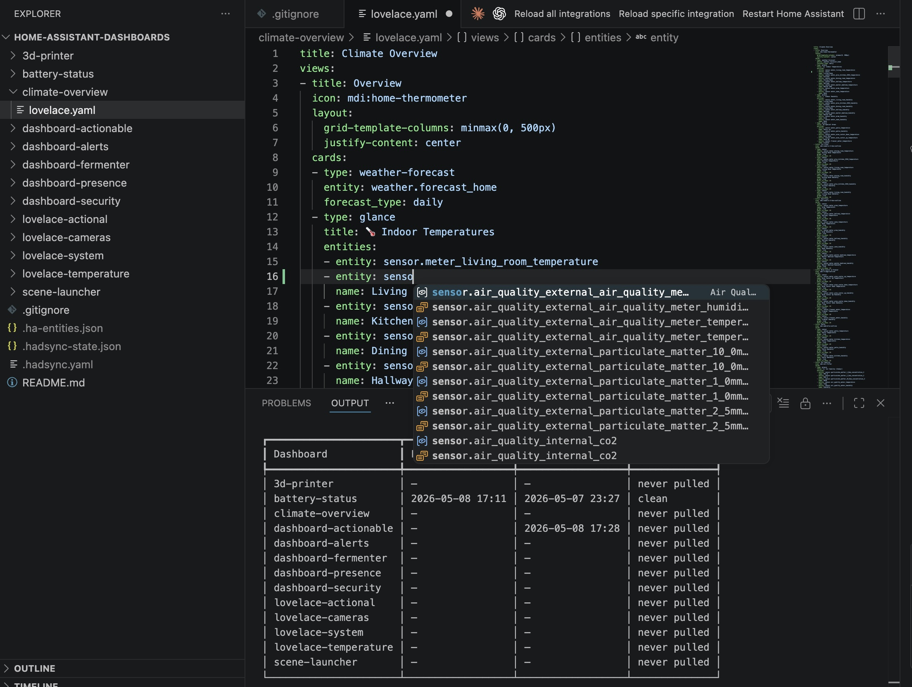
*Dashboard explorer, entity ID autocomplete, and hadsync sync status — all in VS Code.*


*Hover any entity ID to see its live value and attributes, courtesy of the HA Config Helper extension.*

---

[Features](#features) · [Quick Start](#quick-start) · [Commands](#commands) · [In Action](#in-action) · [Conflict Detection](#conflict-detection) · [Validation](#validation) · [VS Code Extension](#vs-code-extension) · [Configuration](#configuration) · [Installation](#installation)

---

## Features

- Pull any or all Lovelace dashboards from a live HA instance to local YAML
- Push locally edited YAML back to HA — change summary, destructive-change warnings, explicit confirmation
- Three-phase validation (syntax → entity IDs → card schema) run before every push
- Diff local YAML vs live HA state — conflict detection, view-level summary, coloured unified diff
- Entity ID validation against a cached HA entity registry (621 entities on a typical instance)
- Card schema validation — 35 standard Lovelace card types, `custom:*` always allowed
- Watch mode — validates on every file save; optional auto-push when validation passes
- Status table — last pull/push timestamps and local change detection per dashboard
- **VS Code extension** — inline diagnostics, command palette, status bar, entity ID autocomplete
- Git-friendly: plain YAML files, one directory per dashboard named by `url_path`

## Installation

```bash
pip install hadsync
```

Requires Python 3.11+.

**With uv (recommended — installs globally so `hadsync` works from any directory):**

```bash
uv tool install hadsync
```

After installation, `hadsync` is available system-wide. Upgrade to a newer release with:

```bash
pip install --upgrade hadsync
# or
uv tool upgrade hadsync
```

### Install from source

```bash
# editable install — code changes take effect immediately
uv tool install --editable /path/to/hadsync

# or with pip
pip install -e ".[dev]"
```

## Two-Repo Setup (Recommended)

hadsync is designed to keep two things separate:

- **`hadsync/`** — this repo ([github.com/gevgev/hadsync](https://github.com/gevgev/hadsync)), CLI tool source code only
- **`home-assistant-dashboards/`** — a dedicated repo for your dashboard YAML files

This means your dashboard history is independent of the tool version history, and you can share or back up dashboards without exposing tool internals.

## Quick Start

```bash
# 1. Set your HA long-lived access token
export HA_TOKEN=eyJ...

# 2. Create and enter your dashboards repo
mkdir home-assistant-dashboards && cd home-assistant-dashboards
git init

# 3. Initialize hadsync (creates .hadsync.yaml here, workspace defaults to .)
hadsync init

# 4. List available dashboards on your HA instance
hadsync list

# 5. Pull all dashboards to local YAML
hadsync pull

# 6. Edit in VS Code (or any editor)
code .

# 7. Validate before pushing
hadsync validate

# 8. Push back to HA
hadsync push
```

Alternatively, keep `.hadsync.yaml` anywhere and point to the dashboards folder via env var:

```bash
export HA_TOKEN=eyJ...
export HADSYNC_WORKSPACE=~/home-assistant-dashboards
hadsync pull   # works from any directory
```

## Configuration

`hadsync init` creates `.hadsync.yaml` in the current directory:

```yaml
ha_url: http://homeassistant.local:8123
ha_token: ${HA_TOKEN}          # env var reference — never store the token literally
workspace: .                   # path to dashboard YAML files; defaults to current directory

pull:
  refresh_entities: true       # refresh entity cache on every pull
  dashboards: all              # or list: [lovelace, battery-status]

push:
  require_validation: true     # block push on validation errors
  confirm: true                # ask for confirmation before each push

validation:
  warn_on_unknown_entities: true        # Phase 2: warn vs error for unknown entity IDs
  entity_cache_max_age_days: 7          # warn if entity cache is older than this
  custom_card_types: []                 # Phase 3: extra type prefixes treated as valid
                                        # e.g. ["my-custom:"] alongside custom:*
```

### Environment Variables

| Variable | Description |
|---|---|
| `HA_TOKEN` | HA long-lived access token (referenced as `${HA_TOKEN}` in config) |
| `HADSYNC_WORKSPACE` | Override the workspace directory at runtime — takes priority over config |

The token is always referenced via an environment variable. Never embed it in the config file.

## Commands

| Command | Description |
|---|---|
| `hadsync init` | Interactive setup: URL, token env var, workspace dir |
| `hadsync list` | List all storage-mode dashboards on the HA instance |
| `hadsync pull [ID]` | Pull one or all dashboards from HA to local YAML; refreshes entity cache |
| `hadsync push [ID]` | Push local YAML to HA — validates (P1+P2+P3), shows change summary, confirms |
| `hadsync push [ID] --dry-run` | Show what would be sent without pushing |
| `hadsync diff [ID]` | Compare local vs HA — conflict detection, pull timestamp, view-level summary |
| `hadsync diff [ID] --show` | As above, plus coloured unified diff |
| `hadsync validate [ID]` | Run Phase 1+2+3 validation without pushing |
| `hadsync watch [ID]` | Watch for file saves and validate automatically |
| `hadsync watch [ID] --auto-push` | Watch and push to HA when validation passes |
| `hadsync status` | Table: last pull, last push, local change state per dashboard |
| `hadsync entities refresh` | Fetch all entity IDs from HA and update local cache |
| `hadsync entities list [filter]` | List cached entities, filtered by domain or friendly name |
| `hadsync config show` | Print resolved config (token masked, workspace source shown) |
| `hadsync config set KEY VALUE` | Set a config value |

**Global flags:** `--dry-run`, `--verbose / -v`, `--quiet / -q`, `--yes / -y`, `--json-output`, `--config PATH`

## Validation

`hadsync validate` (and pre-push validation in `hadsync push`) runs three phases:

| Phase | What it checks |
|---|---|
| 1 — Syntax & structure | YAML parse errors (with line numbers), `views` key present and a list, no non-mapping view entries |
| 2 — Entity IDs | Every `entity:` / `entities:` reference checked against `.ha-entities.json` cache; warns on unknowns; skipped if cache absent |
| 3 — Card schema | Each card's `type` is a known standard type; required fields are present; `custom:*` cards always pass |

Phase 2 is silently skipped if the entity cache doesn't exist yet — run `hadsync entities refresh` to enable it. Phase 3 warns on unknown types rather than blocking, so HACS cards never cause failures.

## Conflict Detection

Every `hadsync pull` stores a hash of the HA config in `.hadsync-state.json`. `hadsync diff` uses this to classify divergences:

| Situation | HA hash | Local mtime | Verdict |
|---|---|---|---|
| Both changed since pull | changed | > last pull | **CONFLICT** — explicit next-step options shown |
| HA changed, local clean | changed | ≤ last pull | Suggests `hadsync pull <id>` |
| Local changed, HA untouched | same | > last pull | Suggests `hadsync push <id>` |
| Never pulled / old state | no hash | — | Diff shown without classification |

Example CONFLICT output:
```
battery-status
  Last pull: 2026-05-10 18:19  (2h ago)
  HA:    1 views, 5 cards  ← changed since pull
  Local: 1 views, 5 cards  ← modified since pull
    ~ Battery Status: content changed

  ✗  CONFLICT — both sides changed since last pull.
       hadsync push battery-status  — overwrite HA with local (discards HA edits)
       hadsync pull battery-status  — overwrite local with HA (discards local edits)
```

## In Action

### `hadsync validate` — issues found

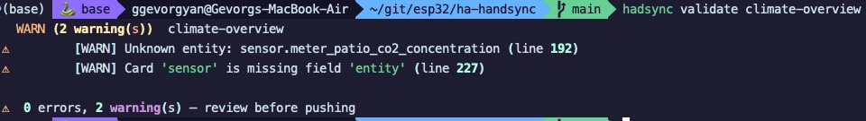

*Validation catches two problems before anything reaches HA: an entity ID that no longer exists in the registry, and a `sensor` card missing its required `entity` field. Both are reported with exact line numbers.*

### `hadsync validate` — all clear

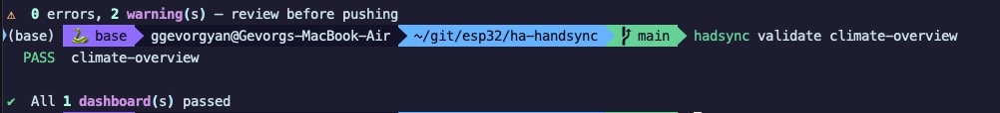

*After fixing the two issues the dashboard passes cleanly. The same command validates all dashboards at once when run without an ID argument.*

### `hadsync validate` — full suite

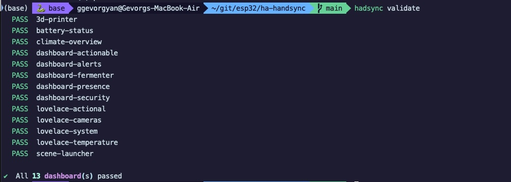

*All 13 storage-mode dashboards pass in a single run — safe to use in CI pipelines since the command exits non-zero on any error.*

### `hadsync status` — sync overview

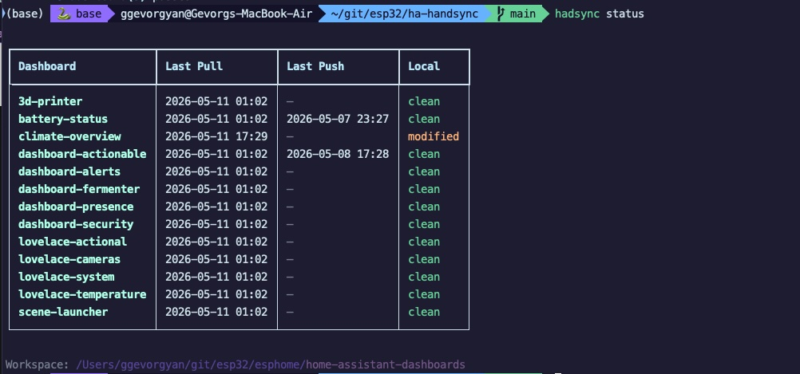

*A quick at-a-glance table showing when each dashboard was last pulled, when it was last pushed, and whether the local file has been modified since the pull. `climate-overview` shows as `modified` — a local edit is pending.*

### `hadsync push` — safe confirmation

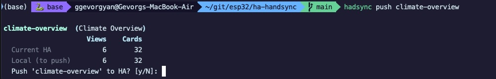

*Before pushing, hadsync shows the current HA state alongside what would be sent — 6 views, 32 cards on both sides here — and requires an explicit `y` to proceed. A `--dry-run` flag shows this summary without connecting to HA at all.*

### `hadsync diff` — conflict summary

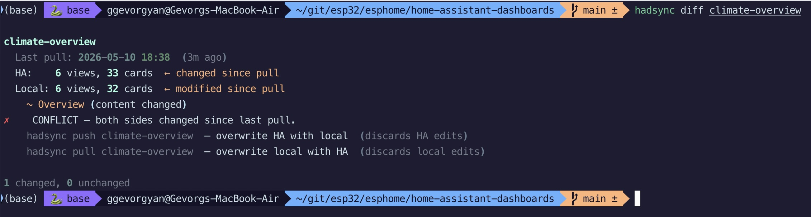

*Both HA and local changed since the last pull — hadsync detects the conflict, identifies the modified view, and shows the two resolution options with their consequences.*

### `hadsync diff --show` — unified diff

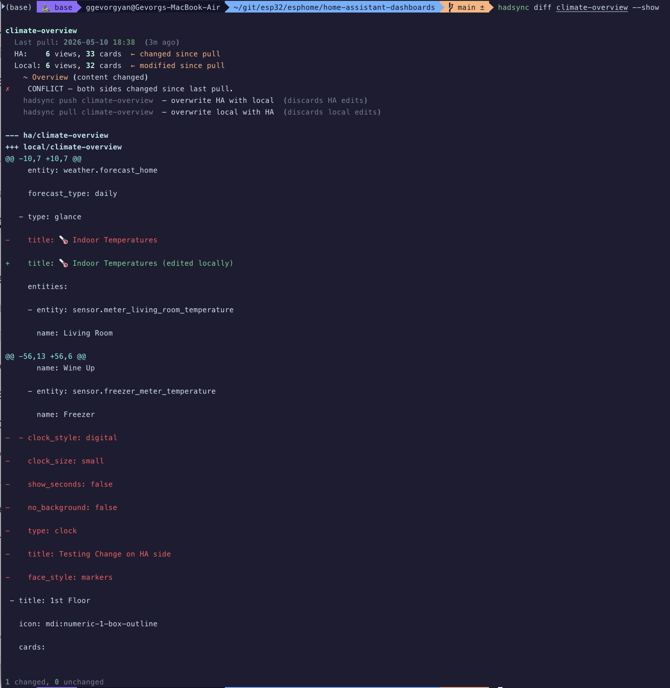

*The `--show` flag appends a full coloured unified diff beneath the conflict summary: red lines are what HA currently has, green lines are what your local file contains. Changes are shown at the YAML level so you can see exactly which card fields or view titles were edited on each side.*

### VS Code — inline diagnostics and Problems panel

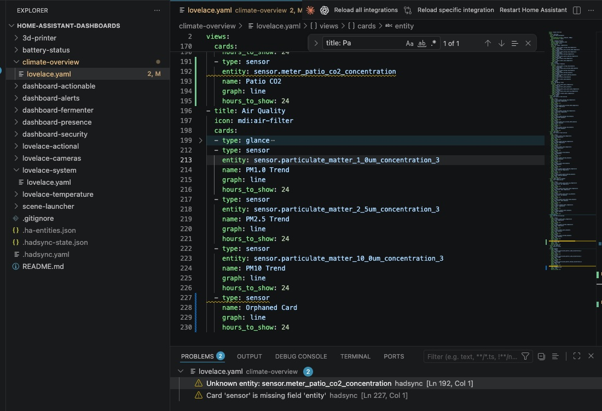

*hadsync validation runs on every save and surfaces issues as inline squiggles and Problems panel entries with exact line numbers — here flagging an unknown entity ID (`sensor.meter_patio_co2_concentration` no longer exists in HA) and a `sensor` card that is missing its required `entity` field. Both issues are caught before anything is pushed to HA.*

### VS Code — entity autocomplete alongside live diagnostics

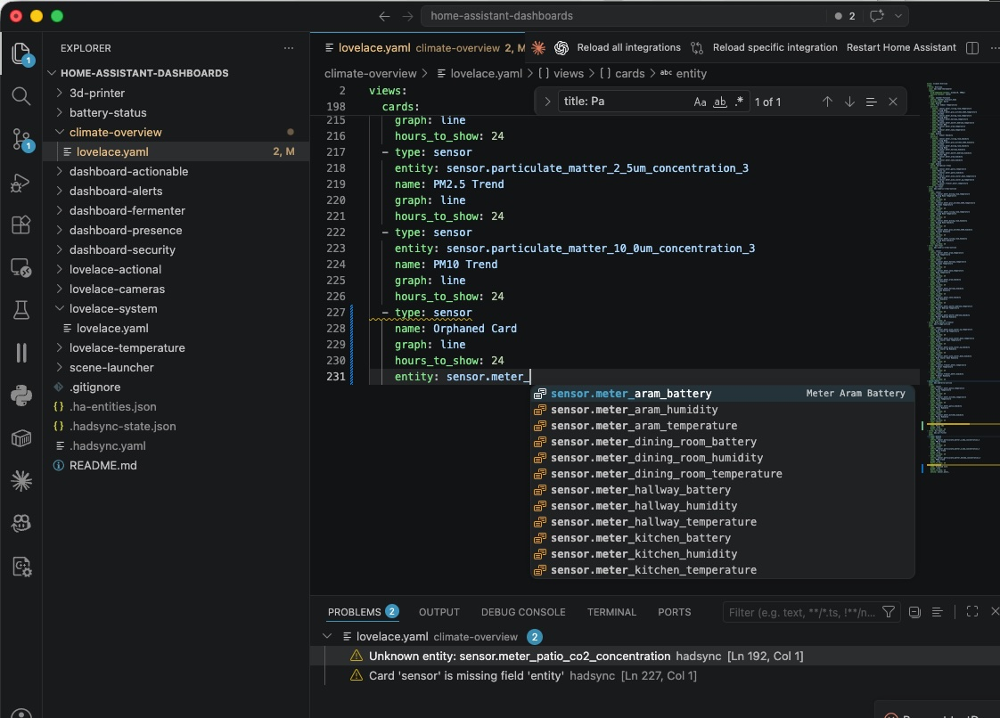

*Typing a partial entity ID opens a completion list drawn from the hadsync entity cache (621 entities, refreshed on pull). Friendly names appear on the right for quick identification. The Problems panel remains visible below — you can fix the flagged issue and pick the correct entity in the same editor without switching context.*

### VS Code — command palette

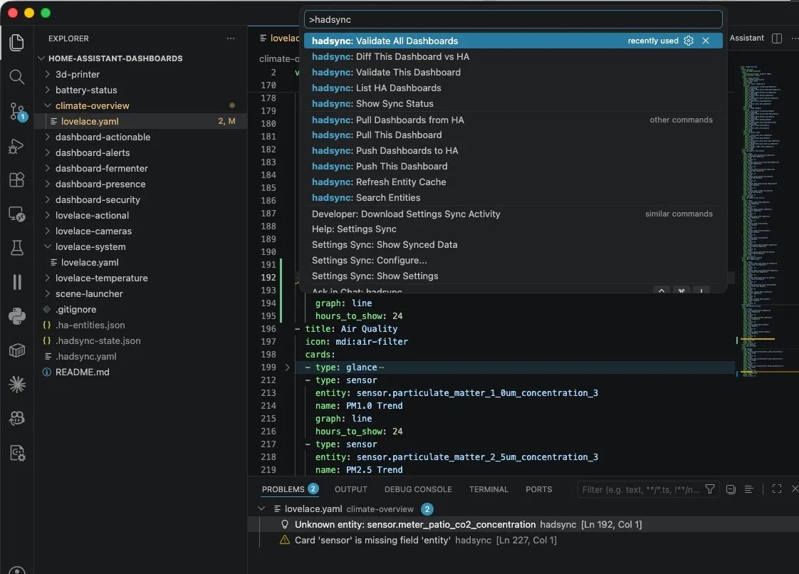

*All hadsync operations are available from `Cmd+Shift+P`. The full set — validate, diff, pull, push, status, list, entity cache refresh, entity search — without leaving VS Code or opening a terminal.*

## Workspace Layout

```
home-assistant-dashboards/      # dashboards repo — committed to git
  .hadsync.yaml                 # connection config (workspace: .)
  .gitignore                    # excludes state/cache files
  battery-status/
    lovelace.yaml
  lovelace-cameras/
    lovelace.yaml
  dashboard-security/
    lovelace.yaml
  ...                           # one directory per dashboard (named by url_path)
```

Files excluded from git (auto-added to `.gitignore` by `hadsync init`):
- `.hadsync-state.json` — last pull/push timestamps per dashboard
- `.ha-entities.json` — entity ID cache (refreshed on every pull)

## Development

```bash
# Install globally so hadsync works from any directory
uv tool install --editable /path/to/hadsync

# Install dev dependencies for running tests
uv sync --extra dev
uv run pytest tests/

# Run against a real HA instance
export HA_TOKEN=eyJ...
hadsync list
```

### CI

GitHub Actions runs on every push and pull request to `main`:

- **Python tests** — pytest on Python 3.11, 3.12, and 3.13 in parallel
- **TypeScript compile** — ensures the VS Code extension builds cleanly

### Cutting a release

1. Bump `version` in `pyproject.toml` and `vscode-hadsync/package.json`
2. Add an entry to `CHANGELOG.md` (and `vscode-hadsync/CHANGELOG.md` if the extension changed)
3. Commit and push, then push a version tag:

```bash
git tag v0.X.Y
git push --tags
```

The release workflow triggers automatically on the tag and:
- Runs the full test suite
- Publishes the Python package to PyPI
- Builds the `.vsix` and attaches it to a GitHub Release with the changelog entry as the release body

## VS Code Extension

The `vscode-hadsync/` directory contains a VS Code extension that wraps the CLI.

### Installation (one-time)

Download the latest `.vsix` from the [GitHub Releases page](https://github.com/gevgev/hadsync/releases/latest), then install it:

```bash
code --install-extension hadsync-<version>.vsix
```

**VS Code UI alternative:** `Cmd+Shift+P` → `Extensions: Install from VSIX...` → select the downloaded file.

Restart VS Code. The extension activates automatically in any workspace folder that contains a `.hadsync.yaml` file.

#### Build from source

```bash
cd vscode-hadsync
npm install
npm run compile
npx @vscode/vsce package --no-dependencies
code --install-extension hadsync-$(node -p "require('./package.json').version").vsix
```

### Updating

Download the latest `.vsix` from [Releases](https://github.com/gevgev/hadsync/releases/latest) and re-run the install command — VS Code replaces the previous version automatically.

### Features

- **Inline diagnostics** — validates every `lovelace.yaml` on save; errors and warnings appear in the Problems panel (`Cmd+Shift+M`) and as editor squiggles with line numbers; **automatically re-validates when files change externally** (e.g. after `hadsync pull` in the terminal)
- **Command palette** (`Cmd+Shift+P`) — pull, push (with VS Code confirmation dialog), validate, diff, status, list, entities refresh/search
- **Status bar** — bottom-left shows last pull time or count of locally-modified dashboards (based on file mtime, matching `hadsync status`); click for full status table
- **Entity autocomplete** — typing `entity: ` triggers completions from `.ha-entities.json` with friendly name and domain
- **Right-click context menu** — validate / push / diff available directly in any `lovelace.yaml` editor

Pair hadsync with the [Home Assistant Config Helper](https://marketplace.visualstudio.com/items?itemName=keesschollaart.vscode-home-assistant) extension for a complete live editing experience: hover over any entity ID to see its **current state, last-changed timestamp, and attributes** pulled directly from your running HA instance — while hadsync validation ensures every referenced entity actually exists.

### Settings

| Setting | Default | Description |
|---|---|---|
| `hadsync.executablePath` | `""` | Full path to hadsync binary. Leave blank to use PATH. |
| `hadsync.validateOnSave` | `true` | Validate automatically when a lovelace.yaml is saved. |
| `hadsync.autoPushOnSave` | `false` | Push to HA automatically after a clean validation on save. |

## Implementation Status

| Phase | Description | Status |
|---|---|---|
| 1 — Core CLI | pull / push / validate / diff / status / state tracking | ✅ Complete |
| 2 — Entity Validation | entity cache, entity ID existence checks in YAML | ✅ Complete |
| 3 — Schema Validation & Watch | card type schema, watch mode, auto-push, enhanced diff | ✅ Complete |
| 4 — VS Code Extension | palette commands, inline diagnostics, entity autocomplete | ✅ Complete |

## HA API Notes

Tested against **Home Assistant 2026.5**. Key WS commands used:

| Operation | Command |
|---|---|
| List dashboards | `get_panels` (filter `component_name=lovelace`) |
| Fetch dashboard config | `lovelace/config` with `url_path` |
| Save dashboard config | `lovelace/config/save` with `url_path` |
| Fetch entity list | `GET /api/states` (REST) |

> **Note:** The design document references `lovelace/dashboards` and `lovelace/save_config` — these commands do not exist in HA 2026.5. The correct commands are listed above.

## License

MIT
